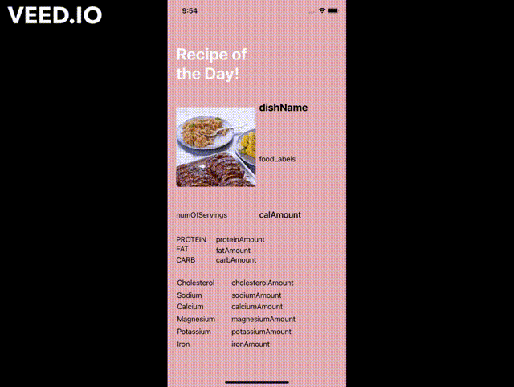
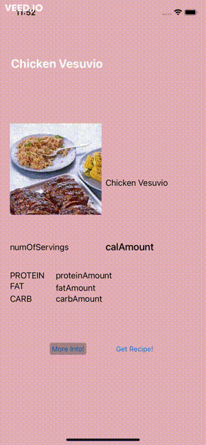
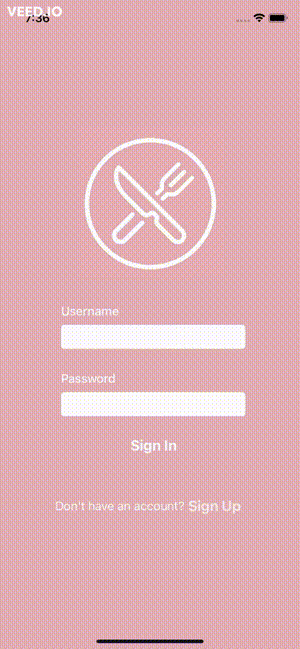

Unit 8: Group Milestone - README
===
# LivFit

## Table of Contents
1. [Overview](#Overview)
1. [Product Spec](#Product-Spec)
1. [Wireframes](#Wireframes)
1. [Schema](#Schema)

## Overview
### Description
Suggests healthy recipes for users to make and also exercises they can do to stay healthy. 

### App Evaluation
- **Category:** Health
- **Mobile:** This app would be primarily developed for mobile. Functionality will be limited to mobile devices, however it could work on computers.
- **Story:** Suggests healthy recipes and exercises to users to keep them healthy
- **Market:** Any individual that is interested in living a healthier life.
- **Habit:** This app would be used daily and even multiple times a day when users decide they want to exercise or make a healthy meal.
- **Scope:** First we would start with people that are already motivated to lead a healthy life, then we could broaden our scope to people that are wanting to get into exercising and being healthier. 

## Product Spec
### 1. User Stories (Required and Optional)

**Required Must-have Stories**

* - [x] User login page design.
* - [x] User login page logic.
* - [X] Register page design
* - [x] Register page logic
* - [X] Create and Setup Database
* - [x] All recipes page design.
* - [x] All recipes page logic.
* - [x] Recipe page design.
* - [x] Recipe page logic.
* - [x] All workouts page design.
* - [x] All workouts page logic.
* - [x] Workout page design.
* - [x] Workout page logic.
* - [x] Landing page.

**Optional Nice-to-have Stories**

* Profile page
* User can favorite recipes.
* User can create their own recipe
* Random recipe suggestion button
* Add comments/review recipe
* Star ranking for recipes
* Search for recipes

### 2. Screen Archetypes

* Login 
* Register - User signs up or logs into their account
   * Upon register users will be asked for their taste to be properly suggested recipes they'll like.
* Landing page - Welocmes the user
   * Will have a navigation bar to access other screens.
* Recipe Screen 
   * Displays all the information for a given recipe.
* Recipes Screen.
   * Will display a picture and name of all recipes in a column the user can scroll through. They can click on a specific recipe to go to its respective screen
* Workout Screen 
   * Displays all the information for a given workout routine.
* Workouts Screen.
   * Will display a column of available workout routines

### 3. Navigation

**Tab Navigation** (Tab to Screen)

* Recipe selection
* Workout selection

Optional:
* Random recipe
* Random workout

**Flow Navigation** (Screen to Screen)
* Forced Log-in -> Account creation if no log in is available
* landing page -> Navigation bar can go to all other recipes, favorites, or create a recipe
* All recipes -> Display specific recipe. 
* All workouts -> Display specific workout. 

## Wireframes
<br>

## Schema 
### Models
#### User

   | Property      | Type     | Description |
   | ------------- | -------- | ------------|
   | objectId      | String   | unique id for the user (default field) |
   | username      | String   | username for user |
   | password      | String   | password for user |
   
### Networking
#### List of network requests by screen
   - All Recipes Screen
     - (Read/GET) Query all recipes
         ```swift
         let query = PFQuery(className:"Recipe")
         query.order(byDescending: "createdAt")
         query.findObjectsInBackground { (posts: [PFObject]?, error: Error?) in
            if let error = error { 
               print(error.localizedDescription)
            } else if let recipes = recipes {
               print("Successfully retrieved \(recipes.count) recipes.")
           // TODO: Do something with recipes...
            }
         }
         ```
  - Specific Recipe Screen
      - (Read/GET) Query specific recipes
         ```swift
         let query = PFQuery(className:"Recipe")
         query.whereKey("id", equalTo: currentRecipe.id)
         query.order(byDescending: "createdAt")
         query.findObjectsInBackground { (posts: [PFObject]?, error: Error?) in
            if let error = error { 
               print(error.localizedDescription)
            } else if let recipe = recipe {
               print("Successfully retrieved \(recipe.count) recipe.")
           // TODO: Do something with recipe...
            }
         }
         ```
 - All Workouts Screen
     - (Read/GET) Query all recipes
         ```swift
         let query = PFQuery(className:"Workout")
         query.order(byDescending: "createdAt")
         query.findObjectsInBackground { (posts: [PFObject]?, error: Error?) in
            if let error = error { 
               print(error.localizedDescription)
            } else if let workouts = workouts {
               print("Successfully retrieved \(Workout.count) recipes.")
           // TODO: Do something with Workout...
            }
         }
         ```
  - Specific Workout Screen
      - (Read/GET) Query specific recipes
         ```swift
         let query = PFQuery(className:"Workout")
         query.whereKey("id", equalTo: currentWorkout.id)
         query.order(byDescending: "createdAt")
         query.findObjectsInBackground { (posts: [PFObject]?, error: Error?) in
            if let error = error { 
               print(error.localizedDescription)
            } else if let workout = workout {
               print("Successfully retrieved \(Workout.count) recipe.")
           // TODO: Do something with Workout...
            }
         }
         ```
      

## Progress (via Gifs)
### Sprint 1




